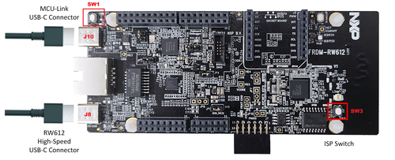
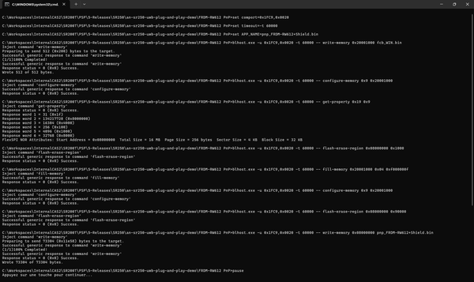
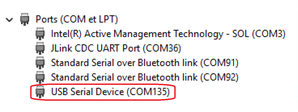
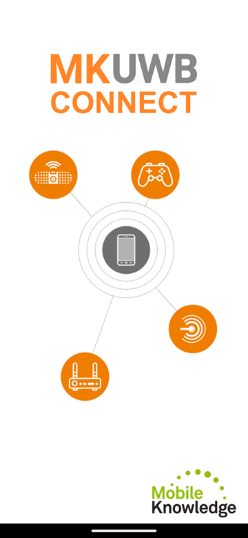
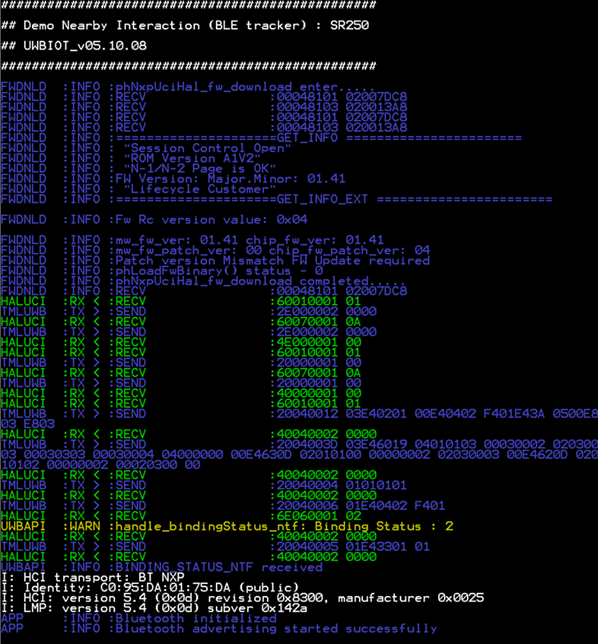
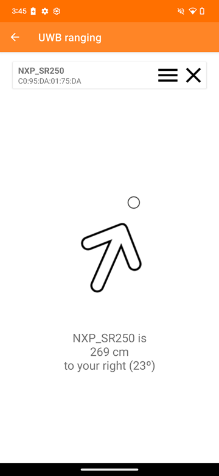
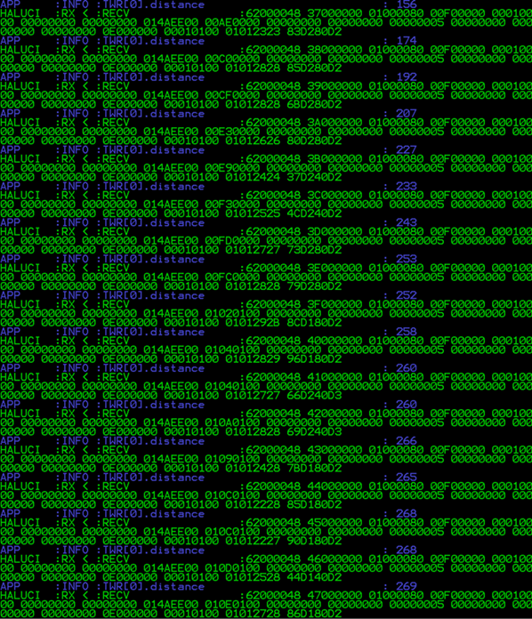

# NXP Application Code Hub
[](https://www.nxp.com)

## UWB Nearby Interaction with phones
Our demonstration showcases how our accessory uses <strong>Nearby Interaction</strong> protocol to communicate seamlessly with Apple® or Android devices equipped with <strong>Ultra‑Wideband (UWB)</strong> technology. You’ll see how precisely the device can detect distance and direction, enabling intuitive, real‑time interactions that feel smooth, responsive, and effortless.

#### Boards: FRDM-RW612

## Table of Contents
1. [Hardware](#step1)
2. [Setup](#step2)
3. [Demo](#step3)
4. [FAQs](#step4)
5. [Support](#step5)
6. [Release Notes](#step6)

## 1. Hardware<a name="step1"></a>

- [SR250-ARD Development Board](https://www.nxp.com/SR250UWBSHIELD)
- [FRDM-RW612 Development Board](https://www.nxp.com/FRDM-RW612)  
  ⚠️ Requires a small rework because SPI is not exposed on the Arduino headers. See rework instruction [here](./FRDM-RW612_rework_for_SPI.md).
- Windows PC
- Two USB-C cables (power + communication)

Additionaly you'll need a smartphone with UWB support, either Apple® (Any iPhone from iPhone 11 onwards, except models 16e and 17e) or Android (e.g. Google Pixel Pro series, Samsung S21+ to S26 series, ...). A complete list of compatible devices can be found on Wikipedia related page: [List of UWB-enabled mobile devices](https://en.wikipedia.org/wiki/List_of_UWB-enabled_mobile_devices).


## 2. Setup<a name="step2"></a>
### 2.1 Accessory side
Flash the SR250 demo_nearby_interaction application to the FRDM-RW612.
<a name="download-package"></a>At first, download the [UWB Trimension SR250 Nearby Interaction Demo application package](https://www.nxp.com/webapp/Download?colCode=UWB-S250-NEARBY-INTERACTION-DEMO).



1. Connect two USB-C cables:
    - One to MCU-Link USB-C (J10)
    - One to High-Speed USB-C (J8)
2. Hold ISP button (SW3) → press & release Reset button (SW1) → release ISP button. The board is now in ISP over USB mode.
3. Run the flashing script from the [application package](#download-package) previously downloaded and unzipped:

```bash
program_FRDM-RW612.bat
```



Once flashing is complete, disconnect and reconnect both USB-C cables to reboot the board. The FRDM-RW612 will enumerate as a Virtual COM port.
Identify the COM port using Device Manager:



### 2.2 Phone side
On the phone side, install the MK UWB connect application:
- **Apple iPhone**: Download from the [Apple App Store](https://apps.apple.com/us/app/mk-uwb-connect/id6444850424)
- **Android**: Download from [Google Play Store](https://play.google.com/store/apps/details?id=com.themobileknowledge.uwbconnectapp&pcampaignid=web_share)



## 3. Demo<a name="step3"></a>
Open your serial terminal application, connecting to the FRDM-RW612 HS-USB interface through Virtual COM port with the following configurations:
- Baud rate: 3 Mbit/s
- Data: 8 bits
- Parity: None
- Stop bits: 1 bit
- Flow control: None
- New Line Receive: AUTO

After resetting the FRDM-RW612 board, the demo application will display initialization messages, status updates, and operational logs in the terminal window.



On the phone side, open the MK UWB Connect application. It offers several demo modes (Ranging, Distance Alert, Tracker, ...). You can experience any of them, all will interact with the SR250 Nearby Interaction accessory. For instance, for the Ranging mode, the application will display the accessory's distance and direction relative to the phone:




Once the MK UWB Connect application on your phone detects the FRDM-RW612 accessory, the following interactions will be available on the accessory side:



## 4. FAQs<a name="step4"></a>
- **Q: What if flashing the demo application fails?**
  - Verify the FRDM-RW612 board is in ISP mode (see step 3.1).
  - Ensure both USB-C cables are properly connected.
  - Try using a different USB cables.
  - Try entering ISP by plugging the MCU-Link USB-C cable while keeping the ISP button pressed
- **Q: What if the phone cannot detect the accessory ?**
  - Make sure Bluetooth is enabled on the phone.
  - Ensure both devices are within range (typically 0-20 meters depending on environment).
  - The accessory application pauses until a serial terminal connection is opened.
- **Q: Can I connect several phones to the same accessory?**
  - Yes, the SR250 supports multiple simultaneous connections within its BLE advertising range.
- **Q: How can I find the demo application source code?**
  - The source code of the SR250 accessory application can be found in [SR250 UWB IoT Middleware](https://github.com/nxp-uwb/sr250-uwbiot-zephyr) (refer to demo_nearby_interaction project).
  - For the source code of the phone application, please contact our partner [MobileKnowledge](https://www.themobileknowledge.com/product/mk-uwb-sw-kit-mobile-edition-2-0-nxp-trimension-sr250/).

## 5. Support<a name="step5"></a>
- Reach out to NXP Community page for more support - [NXP Community](https://community.nxp.com/)
- Learn more about SR250 UWB IC for Industrial IoT Ranging and Radar Applications - [Trimension® SR250](https://www.nxp.com/products/SR250)

#### Project Metadata

<!----- Boards ----->
[]()

<!----- Categories ----->
[](https://mcuxpresso.nxp.com/appcodehub?category=sensor)

<!----- Peripherals ----->
[](https://mcuxpresso.nxp.com/appcodehub?peripheral=usb)

<!----- Toolchains ----->
[](https://mcuxpresso.nxp.com/appcodehub?toolchain=vscode)

Questions regarding the content/correctness of this example can be entered as Issues within this GitHub repository.

>**Warning**: For more general technical questions regarding NXP Microcontrollers and the difference in expected functionality, enter your questions on the [NXP Community Forum](https://community.nxp.com/)

[](https://www.youtube.com/NXP_Semiconductors)
[](https://www.linkedin.com/company/nxp-semiconductors)
[](https://www.facebook.com/nxpsemi/)
[](https://x.com/NXP)

## 6. Release Notes<a name="step6"></a>
| Version | Description / Update                           | Date                        |
|:-------:|------------------------------------------------|----------------------------:|
| 1.0     | Initial release on Application Code Hub        | March 30<sup>th</sup> 2026 |

